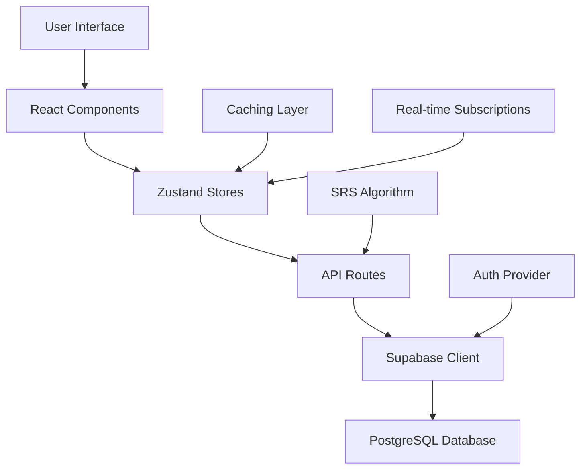

# Cognify Architecture

## Overview

Cognify is a modern AI-powered flashcard application built with Next.js 15 and React 19, featuring a sophisticated Spaced Repetition System (SRS) similar to Anki. The architecture emphasizes performance, scalability, and user data ownership.

## Technology Stack

### Frontend

- **Framework**: Next.js 15 with App Router
- **UI Library**: React 19 with TypeScript
- **Styling**: Tailwind CSS + DaisyUI components
- **State Management**: Zustand stores with sophisticated caching
- **Build Tool**: Turbopack for fast development
- **Package Manager**: pnpm for efficient dependency management

### Backend & Database

- **Database**: Supabase (PostgreSQL) with real-time subscriptions
- **Authentication**: Supabase Auth with JWT tokens
- **API Layer**: Next.js API routes with TypeScript
- **File Storage**: Supabase Storage for avatars and assets

### Deployment & Monitoring

- **Hosting**: Vercel with automatic deployments
- **Analytics**: Vercel Analytics and Speed Insights
- **Monitoring**: Built-in error tracking and logging

## Application Architecture

### Project Structure

```
cognify/
├── app/                    # Next.js App Router
│   ├── (main)/            # Authenticated route group
│   │   ├── dashboard/     # Main dashboard
│   │   ├── projects/      # Project management
│   │   ├── settings/      # User settings
│   │   └── components/    # Layout-specific components
│   ├── api/               # API route handlers
│   ├── auth/              # Authentication pages
│   └── login/             # Login interface
├── components/            # Shared UI components
├── hooks/                 # Custom React hooks
├── lib/                   # Utility libraries
│   └── supabase/         # Database clients
├── src/                   # Source code
│   ├── components/       # Feature-specific components
│   └── types/            # TypeScript type definitions
└── tests/                # Test files and utilities
```

### Data Flow Architecture



## Core Components

### 1. Authentication System

**Flow**: Supabase Auth → JWT → Row Level Security

```typescript
// Authentication flow
User Login → Supabase Auth → JWT Token → Middleware Validation → Protected Routes
```

**Key Files**:

- `lib/supabase/client.ts` - Browser client
- `lib/supabase/server.ts` - Server-side client
- `lib/supabase/middleware.ts` - Route protection
- `middleware.ts` - Global middleware

**Security**: All tables implement Row Level Security (RLS) policies to ensure users can only access their own data.

### 3. Spaced Repetition System (SRS)

**Algorithm**: Modified SM-2 algorithm compatible with Anki

```typescript
interface SRSCard {
  id: string;
  state: "new" | "learning" | "review";
  due: Date;
  interval: number;
  ease: number;
  step: number;
  lapses: number;
  repetitions: number;
}

interface SRSSettings {
  learningSteps: number[]; // [1, 10, 1440] (minutes)
  graduationInterval: number; // 1 (day)
  maximumInterval: number; // 36500 (days)
  startingEase: number; // 2.5
  easyBonus: number; // 1.3
  hardFactor: number; // 1.2
  newInterval: number; // 0.0
  minimumInterval: number; // 1
}
```

**Key Files**:

- `src/lib/SRSScheduler.ts` - Core algorithm implementation
- `src/lib/SRSSession.ts` - Session management
- `hooks/useSettings.ts` - User settings management

### 4. Caching Architecture

**Multi-Layer Caching System**:

1. **Global Cache** (`hooks/useCache.ts`)

   - TTL-based caching with automatic cleanup
   - Versioning for cache invalidation
   - Development utilities for debugging

2. **Zustand Store Caching**

   - `useCachedProjectsStore` - Project data
   - `useCachedUserProfileStore` - User profiles
   - Automatic invalidation on mutations

3. **Session Storage Batching**
   - Batch API calls to reduce database load
   - `ProjectList` uses batch-stats endpoint
   - Prevents N+1 query problems

```typescript
// Cache usage pattern
const data = await cachedFetch(
  "projects",
  async () => supabase.from("projects").select("*"),
  { ttl: 60000 } // 1 minute cache
);
```

### 5. API Design

**RESTful API Patterns**:

```typescript
// Endpoint structure
GET    /api/projects           # List user projects
POST   /api/projects           # Create new project
GET    /api/projects/[id]      # Get specific project
PUT    /api/projects/[id]      # Update project
DELETE /api/projects/[id]      # Delete project

# Batch operations for performance
GET    /api/projects/batch-stats    # Get stats for all projects
POST   /api/flashcards/batch        # Create multiple flashcards
```

**Error Handling**:

- Consistent error response format
- Proper HTTP status codes
- Server-side input validation
- Graceful degradation

## Performance Optimizations

### 2. Frontend Performance

**React Optimizations**:

- `React.memo` for expensive components
- `useCallback` for stable function references
- `useMemo` for computed values
- Lazy loading for large components

**Caching Strategy**:

- Global cache with TTL expiration
- Automatic cache invalidation
- Background data refresh
- Optimistic updates

**Bundle Optimization**:

- Tree shaking with ES modules
- Dynamic imports for code splitting
- Optimized build with Turbopack
- Image optimization with Next.js

### 3. Caching Patterns

**Cache-First Data Access**:

```typescript
// Always check cache before database
const projects = await cachedFetch(
  `user_projects_${userId}`,
  () => projectApi.loadProjects(),
  { ttl: 5 * 60 * 1000 } // 5 minutes
);
```

**Batch API Consolidation**:

```typescript
// Replace N individual requests with 1 batch
// Before: 25 individual project stat requests
// After: 1 batch request for all project stats
const stats = await fetch("/api/projects/batch-stats");
```

## Security Architecture

### 2. Data Protection

**Isolation**:

- All user data is isolated by user_id
- Foreign key constraints maintain integrity
- No cross-user data access possible

**Input Validation**:

- Server-side validation on all endpoints
- TypeScript types for compile-time safety
- Sanitization of user inputs

### 3. API Security

**Rate Limiting**:

- Per-user rate limits on write operations
- Exponential backoff for failed requests
- Protection against abuse

**Secure Headers**:

- Content Security Policy (CSP)
- CORS configuration
- HTTPS enforcement

## State Management

### 1. Zustand Stores

**Global State Architecture**:

```typescript
// Simplified store pattern
interface ProjectsGlobalState {
  projects: Project[];
  setProjects: (projects: Project[]) => void;
  addProject: (project: Project) => void;
  updateProject: (id: string, updates: Partial<Project>) => void;
  removeProject: (id: string) => void;
}
```

**Key Stores**:

- `useProjectsStore` - Project management
- `useUserProfileStore` - User profile data
- `useSettingsStore` - SRS settings
- `useCacheStore` - Global cache management

### 2. Data Synchronization

**Real-time Updates**:

- Supabase real-time subscriptions for live data
- Automatic UI updates on data changes
- Conflict resolution for concurrent edits

**Optimistic Updates**:

- Immediate UI feedback
- Rollback on server errors
- Consistent state management

## Development Patterns

### 1. Component Architecture

**Separation of Concerns**:

```typescript
// Presentation component
export function ProjectCard({ project, onDelete }) {
  return <div>...</div>;
}

// Container component with logic
export function ProjectList() {
  const { projects, loadProjects } = useProjectsStore();
  const stats = useProjectStats(projects);

  return projects.map((project) => (
    <ProjectCard
      project={project}
      stats={stats[project.id]}
      onDelete={() => handleDelete(project.id)}
    />
  ));
}
```

**Hook Patterns**:

```typescript
// Custom hooks for data fetching
export function useProjects() {
  const [projects, setProjects] = useState([]);

  const loadProjects = useCallback(async () => {
    const data = await cachedFetch("projects", fetchProjects);
    setProjects(data);
  }, []);

  return { projects, loadProjects };
}
```

### 2. Error Handling

**Graceful Degradation**:

```typescript
try {
  const data = await apiCall();
  return data;
} catch (error) {
  console.error("API call failed:", error);
  return fallbackData;
}
```

**User Feedback**:

- Toast notifications for user actions
- Loading states for async operations
- Error boundaries for component failures

### 3. Testing Strategy

**Test Categories**:

- Unit tests for SRS algorithm
- Integration tests for API endpoints
- Component tests for UI interactions
- End-to-end tests for critical user flows

## Deployment Architecture

### 1. Environment Configuration

**Development**:

- Local development with Supabase CLI
- Hot reloading with Turbopack
- Development database seeding

**Production**:

- Vercel deployment with automatic CI/CD
- Environment variable management
- Database migrations with Supabase

### 2. Monitoring & Observability

**Performance Monitoring**:

- Vercel Analytics for page performance
- Database query performance tracking
- Error tracking and alerting

**User Analytics**:

- Aggregated usage statistics
- Performance metrics
- No personal data tracking

## Scalability Considerations

### 1. Database Scaling

**Horizontal Scaling**:

- Read replicas for analytics queries
- Connection pooling for high concurrency
- Query optimization and indexing

**Vertical Scaling**:

- Automatic scaling with Supabase
- Resource monitoring and alerting
- Performance optimization

### 2. Application Scaling

**Caching Strategy**:

- CDN for static assets
- Application-level caching
- Database query caching

**Performance Optimization**:

- Code splitting and lazy loading
- Image optimization
- Bundle size optimization

## Future Architecture Considerations

### 1. Planned Enhancements

**Mobile Support**:

- Progressive Web App (PWA) capabilities
- Mobile-optimized UI components
- Offline study capability

**Advanced AI Integration**:

- Server-side AI processing options
- Enhanced content analysis
- Automatic difficulty assessment

### 2. Technical Debt Management

**Code Quality**:

- Improved TypeScript coverage
- Comprehensive testing suite
- Performance optimization

**Architecture Evolution**:

- Microservices consideration for scaling
- Enhanced caching strategies
- Advanced analytics capabilities

---

This architecture document is maintained alongside the codebase and updated as the system evolves. For specific implementation details, refer to the inline code documentation and the Cognify Instructions document.
